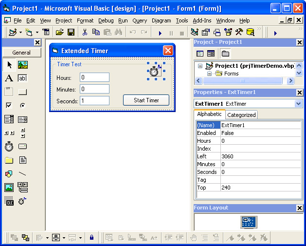



## Enhanced Timer

### Description

An extended Timer Control with an unlimited Interval property. Also, the user-friendly aspect of this Timer like control is enhanced by additional properties such as: Hours, Minutes, and Seconds who's values actually represent Hours, Minutes, and Seconds rather than milliseconds. For instructions regarding the use of this Active-X User Control refer to the Instructions.txt file which is included in this ZIP file. Project requested by: Anonymous PSCode user.
 
### More Info
 

             |
---                |---
**Submitted On**   |2003-01-19 17:18:54
**By**             |[Alex Smoljanovic\(aLeX^rS\)](https://github.com/Planet-Source-Code/PSCIndex/blob/master/ByAuthor/alex-smoljanovic-alex-rs.md)
**Level**          |Intermediate
**User Rating**    |4.4 (31 globes from 7 users)
**Compatibility**  |VB 3\.0, VB 4\.0 \(16\-bit\), VB 4\.0 \(32\-bit\), VB 5\.0, VB 6\.0
**Category**       |[Miscellaneous](https://github.com/Planet-Source-Code/PSCIndex/blob/master/ByCategory/miscellaneous__1-1.md)
**World**          |[Visual Basic](https://github.com/Planet-Source-Code/PSCIndex/blob/master/ByWorld/visual-basic.md)
**Archive File**   |[Enhanced\_T1531751192003\.zip](https://github.com/Planet-Source-Code/alex-smoljanovic-alex-rs-enhanced-timer__1-42573/archive/master.zip)

